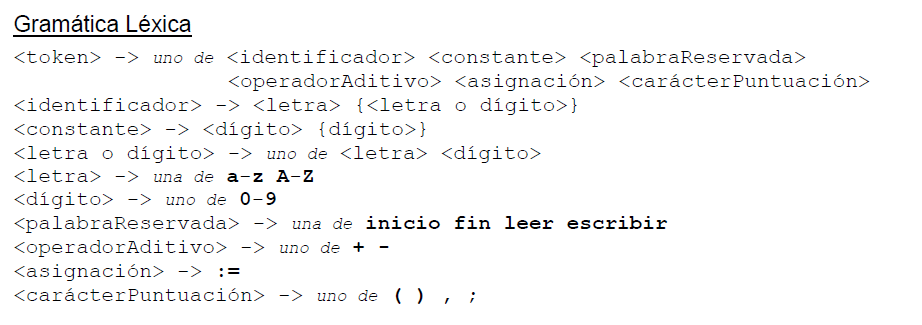
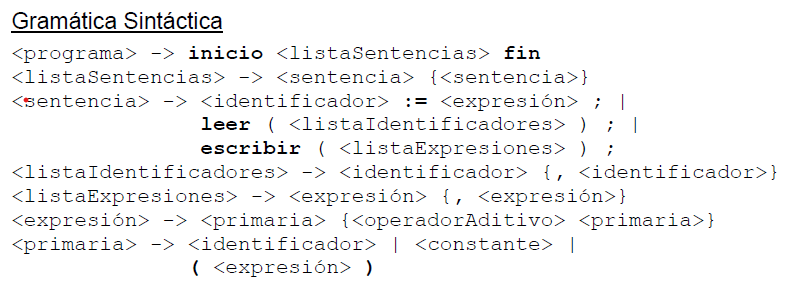

# Sintaxis y Semántica de los lenguajes: Trabajo Practico "Compilador lenguaje Micro"

-En este repositorio se puede encontrar un compilador del lenguaje micro construido con las herramientas flex y bison. Flex se utilizó para el armado del scanner del compilador y Bison para el parser ascendente del mismo. Además, se encuentran programadas varias rutinas semánticas en c.

## Descripcion del lenguaje micro

- El único tipo de dato es entero.
- Todos los identificadores son declarados implícitamente y con una
longitud máxima de 32 caracteres.
- Los identificadores deben comenzar con una letra y están compuestos
de letras y dígitos.
- Las constantes son secuencias de dígitos (números enteros).
- Hay dos tipos de sentencias, Asignación y Entrada/Salida
- Cada sentencia termina con un "punto y coma" (;). El cuerpo de un
programa está delimitado por inicio y fin
- inicio, fin, leer y escribir son palabras reservadas y deben
escribirse en minúscula.

## Gramática léxica de micro

## Gramática Sintáctica de micro

## Información académica

- Curso: K2055

- Año de cursada: 2023

- Modalidad : Anual

- Facultad: Universidad Tecnológica Nacional FRBA

## Información de lo integrantes

- Nombre:

- Rodríguez Lucas Ariel

- Golato Barcia Ivan Nahuel

- Sayago Pablo

- Rabahia Maron Leonel

- Schinca Mauro

- Numero de Grupo: 30
  